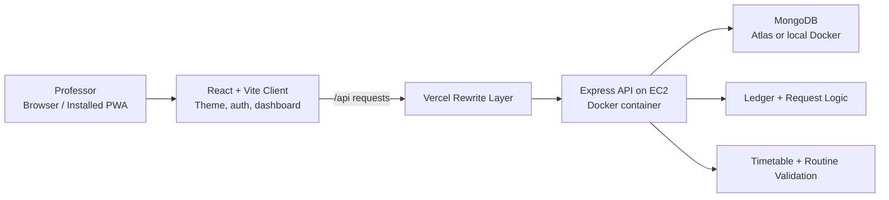
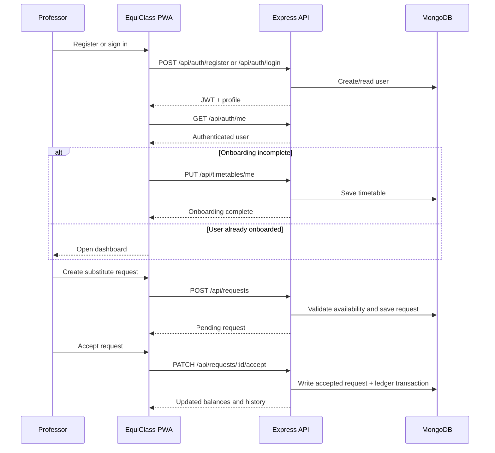
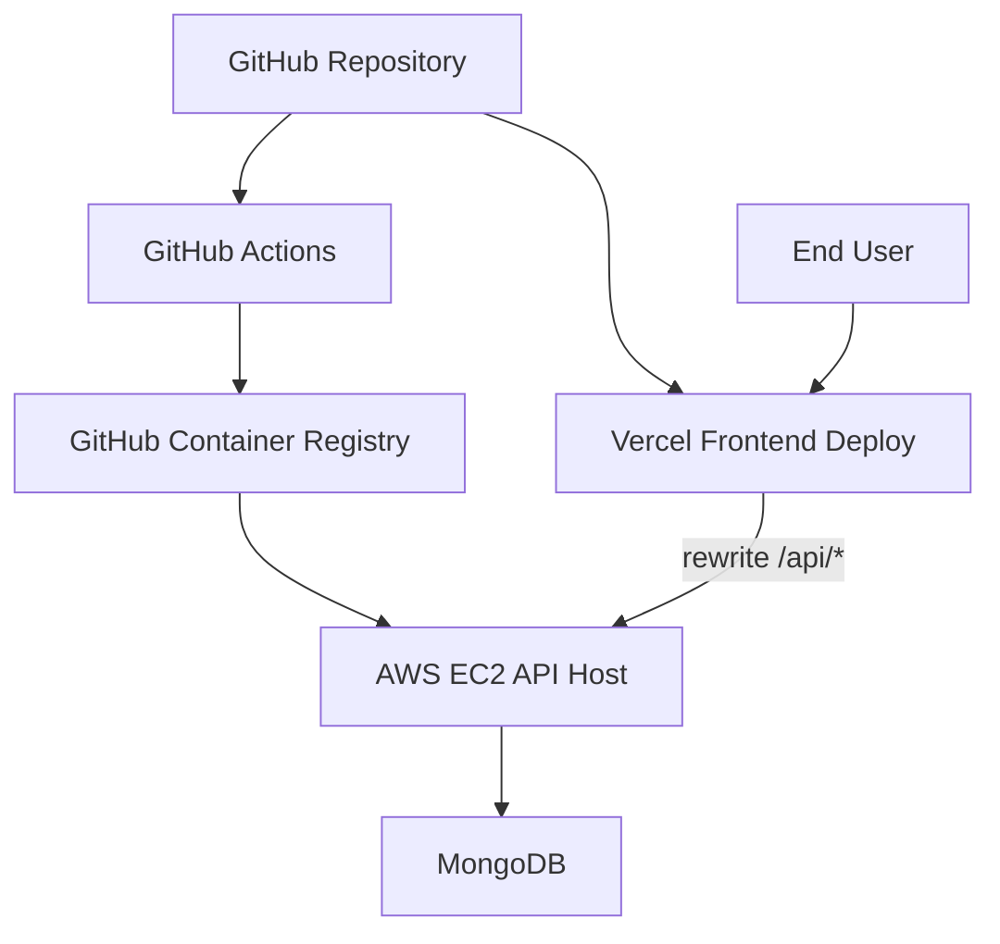

# EquiClass

> EquiClass is the full-stack class coverage platform for faculty teams that need to coordinate substitute lectures, validate availability, and keep a transparent ledger of who owes whom a class.


## Why EquiClass Exists

Faculty scheduling breaks down quickly when leave requests, urgent coverage changes, and informal favors are managed through chat messages alone. EquiClass makes that workflow structured:

- **Requests stay auditable** instead of disappearing in chat threads.
- **Availability is checked before acceptance** using timetable and routine data.
- **Ledger balances remain transparent** so class debt is tracked fairly.
- **The app works well on mobile** as an installable PWA.

## Core Product Highlights

| Area | What it does |
| --- | --- |
| Authentication | Sign up, sign in, restore session, and protect API routes with JWT auth |
| Timetable onboarding | Collect recurring weekly teaching and busy slots before a user reaches the dashboard |
| Substitute requests | Create, accept, decline, and cancel class coverage requests |
| Ledger dashboard | Show what you owe, what others owe you, and your transaction history |
| Routine editor | Maintain a weekly routine grid and validate availability against it |
| Deployment | Run locally with Docker, deploy the frontend to Vercel, and run the API on EC2 |

## System At A Glance



## Main User Flow



## Repository Structure

```text
EquiClass/
|-- client/                     # React + Vite frontend and PWA shell
|-- server/                     # Express API, auth, request, timetable, ledger logic
|-- deploy/                     # EC2 compose files and deployment helpers
|-- docs/                       # Product, flow, API, and deployment docs
|-- .github/workflows/          # CI and deployment automation
\-- docker-compose.yml          # Local full-stack Docker setup
```

## Tech Stack

### Frontend

- React 19
- Vite 7
- Tailwind CSS 4
- GSAP animations
- Context-based auth and theme state
- `vite-plugin-pwa` for installable app support

### Backend

- Node.js 20+
- Express 4
- MongoDB + Mongoose
- JWT authentication
- Helmet, CORS, rate limiting, and input sanitization

### Delivery

- Vercel for the frontend
- Docker for local and server packaging
- GitHub Actions for CI/CD
- EC2 for the deployed API

## Local Development

### 1. Install dependencies

```bash
cd server
npm install

cd ../client
npm install
```

### 2. Configure environment variables

Create a backend `.env` file from the example:

```bash
# macOS / Linux
cp server/.env.example server/.env

# Windows PowerShell
Copy-Item server/.env.example server/.env
```

Optional frontend local env:

```bash
# macOS / Linux
cp client/.env.example client/.env.local

# Windows PowerShell
Copy-Item client/.env.example client/.env.local
```

### 3. Run locally without Docker

Backend:

```bash
cd server
npm run dev
```

Frontend:

```bash
cd client
npm run dev
```

The client proxies `/api` to `http://localhost:5000` in development by default.

### 4. Run locally with Docker

From the repository root:

```bash
docker compose up --build
```

Default ports:

- Frontend: `http://localhost:8080`
- API: `http://localhost:5000`
- Health check: `http://localhost:5000/api/health`

## Environment Variables

### Backend

| Variable | Required | Purpose |
| --- | --- | --- |
| `PORT` | No | API port, defaults to `5000` |
| `NODE_ENV` | No | Runtime mode |
| `MONGO_URI` | Yes | MongoDB connection string |
| `JWT_SECRET` | Yes | Secret used to sign JWT access tokens |
| `JWT_EXPIRES_IN` | No | Access token lifetime, defaults to `15m` |
| `CORS_ORIGIN` | Yes in production | Allowed frontend origin(s), comma-separated if needed |

### Frontend

| Variable | Required | Purpose |
| --- | --- | --- |
| `VITE_API_URL` | No | API base URL, defaults to `/api` |
| `VITE_DEV_API_PROXY_TARGET` | No | Local Vite proxy target, defaults to `http://localhost:5000` |

## API Surface

| Domain | Endpoints |
| --- | --- |
| Health | `GET /api/health` |
| Auth | `POST /api/auth/register`, `POST /api/auth/login`, `GET /api/auth/me` |
| Timetable | `GET /api/timetables/me`, `PUT /api/timetables/me`, `POST /api/timetables/availability`, `POST /api/timetables/override-availability` |
| Users | `GET /api/users` |
| Requests | `POST /api/requests`, `GET /api/requests/incoming`, `GET /api/requests/outgoing`, `PATCH /api/requests/:id/accept`, `PATCH /api/requests/:id/decline`, `PATCH /api/requests/:id/cancel` |
| Ledger | `GET /api/ledger/me/summary`, `GET /api/ledger/me/transactions`, `GET /api/ledger/pairwise` |
| Routine | `GET /api/routine/me`, `PUT /api/routine/update`, `POST /api/routine/check-availability` |

For detailed examples, see [docs/Api.md](docs/Api.md).

## Deployment Topology



### Production Shape

- The **frontend** is deployed on Vercel.
- The **backend** runs in Docker on EC2.
- Vercel rewrites `/api/*` traffic to the backend.
- GitHub Actions builds and deploys the backend container automatically.

Deployment details live in [docs/Deployment.md](docs/Deployment.md).

## CI/CD Workflows

| Workflow | Purpose |
| --- | --- |
| `.github/workflows/ci.yml` | Installs dependencies, builds the client, and syntax-checks the server |
| `.github/workflows/deploy-backend-ec2.yml` | Builds the backend image, pushes it to GHCR, and deploys to EC2 |
| `.github/workflows/deploy-frontend-vercel.yml` | Optional Vercel deployment through GitHub Actions |

## Included Documentation

| File | Focus |
| --- | --- |
| [docs/Plan.md](docs/Plan.md) | Product thinking, domain model, and architecture notes |
| [docs/flow.md](docs/flow.md) | End-to-end user journeys and system logic |
| [docs/Api.md](docs/Api.md) | REST API examples and validation rules |
| [docs/Deployment.md](docs/Deployment.md) | Docker, Vercel, EC2, and GitHub Actions deployment steps |

## Folder-Specific READMEs

- [client/README.md](client/README.md)
- [server/README.md](server/README.md)

## Current Status

The repository already includes:

- a working client onboarding and dashboard flow
- substitute request handling
- ledger summaries and transaction history endpoints
- routine management endpoints and UI
- Dockerized deployment assets
- live-ready Vercel + EC2 deployment support

## Notes

- The repository and product experience now use **EquiClass** consistently.
- The docs in `docs/` include some earlier planning language; this README reflects the shipped JavaScript implementation in the repo today.
