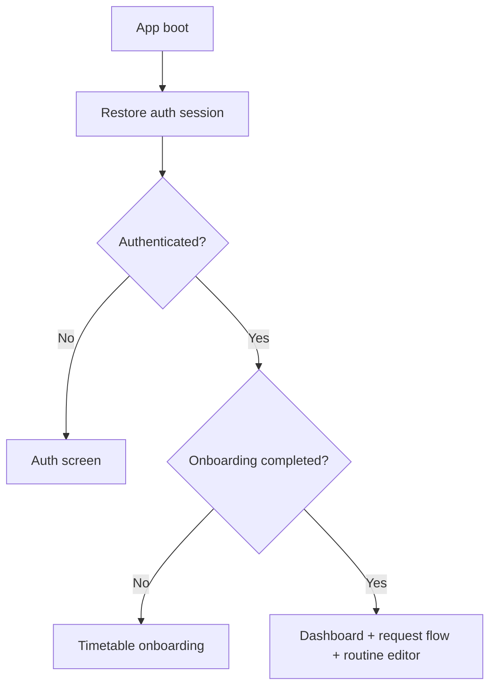

# Client App

This folder contains the EquiClass frontend: the React + Vite application that powers authentication, onboarding, dashboard views, substitute request flows, routine management, and the installable PWA shell.

## Frontend Responsibilities

- restore and protect user sessions
- show the auth landing page and onboarding flow
- render the dashboard, request modal, and ledger summaries
- manage the routine editor experience
- proxy API calls through `/api`
- support installable PWA behavior

## Runtime Flow



## Stack

- React 19
- Vite 7
- Tailwind CSS 4
- GSAP
- React Router DOM
- Vite PWA plugin

## Important Files

| Path | Purpose |
| --- | --- |
| `src/App.jsx` | top-level app shell and auth/onboarding routing |
| `src/context/AuthContext.jsx` | auth state bootstrap and session helpers |
| `src/context/ThemeContext.jsx` | dark/light mode state |
| `src/components/AuthScreen.jsx` | sign in / register experience |
| `src/components/TimetableOnboarding.jsx` | initial onboarding flow |
| `src/components/Dashboard.jsx` | ledger summary and request overview |
| `src/components/RequestSubstituteModal.jsx` | create request flow |
| `src/components/routine/` | weekly routine editor components |
| `src/lib/api.js` | API client and endpoint wrappers |
| `vite.config.js` | Vite setup, PWA plugin, and local API proxy |

## Local Development

```bash
npm install
npm run dev
```

Default dev server:

- `http://localhost:5173`

The frontend calls `/api` by default and uses Vite proxying in development.

## Build

```bash
npm run build
npm run preview
```

## Environment Variables

| Variable | Required | Purpose |
| --- | --- | --- |
| `VITE_API_URL` | No | API base URL, defaults to `/api` |
| `VITE_DEV_API_PROXY_TARGET` | No | Local proxy target, defaults to `http://localhost:5000` |

## Deployment Notes

- Vercel uses [vercel.json](vercel.json) in this folder.
- The frontend expects the backend to be reachable through `/api`.
- In production, the current deployment shape uses a Vercel rewrite to forward `/api/*` to the EC2-hosted backend.

For the full project overview, see the [repository README](../README.md).
