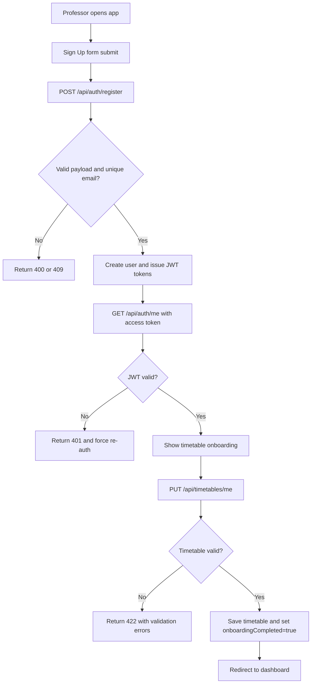
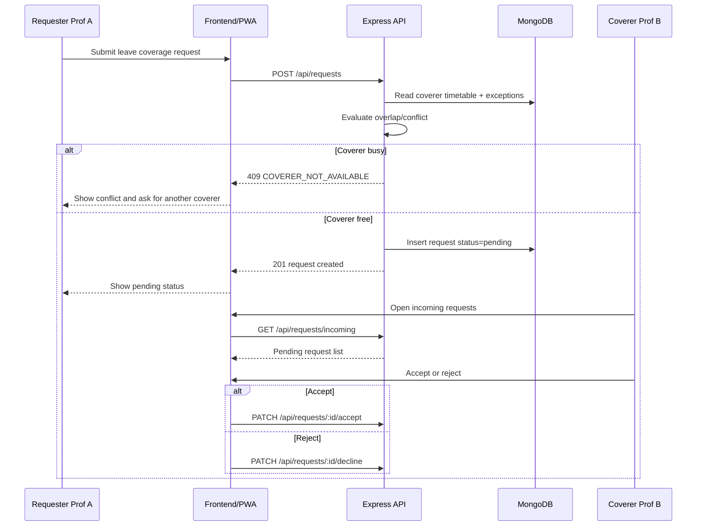
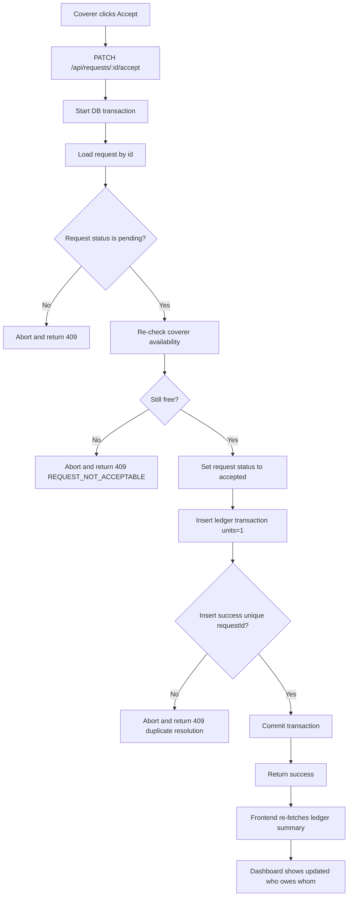

# EquiClass - User Journey and Logic Flow

This document describes the end-to-end flow for onboarding, class coverage requests, and ledger resolution.

## 1. New Professor Onboarding Flow

### 1.1 User Journey (Frontend + Backend)
1. Professor opens the EquiClass web app or installed PWA.
2. Professor clicks Sign Up and submits registration form.
3. Frontend calls `POST /api/auth/register`.
4. Backend validates payload, hashes password, creates user.
5. Backend returns JWT access token and refresh token.
6. Frontend stores session (access token in memory; refresh token as per strategy).
7. Frontend validates session via `GET /api/auth/me` (JWT verification).
8. If valid, user is redirected to onboarding wizard.
9. Professor enters weekly timetable and any date exceptions.
10. Frontend calls `PUT /api/timetables/me`.
11. Backend validates slot formatting and overlap rules.
12. Backend saves timetable and marks `onboardingCompleted=true`.
13. Frontend shows success and redirects to dashboard.

### 1.2 Logic Rules
- Email must be unique.
- Password must satisfy complexity requirements.
- JWT must be valid and unexpired to access onboarding endpoints.
- Timetable slots must satisfy `startTime < endTime`.
- For each day, overlapping slots are rejected unless explicitly allowed by policy.

### 1.3 Mermaid Flow

## 2. Leave Request and Coverage Matching Flow

### 2.1 User Journey (Requester + Coverer + Backend)
1. Requester professor opens Create Request screen.
2. Requester selects colleague, class date/time, course details, and leave reason.
3. Frontend calls `POST /api/requests`.
4. Backend validates request ownership rules and future date/time.
5. Backend performs availability check against coverer timetable:
   - Apply timezone conversion.
   - Check date exceptions first.
   - Check recurring weekly slot overlaps second.
6. If coverer is busy, request creation is rejected with conflict details.
7. If coverer is free, backend creates request with `status=pending` and availability snapshot.
8. Coverer sees request in incoming list via `GET /api/requests/incoming`.
9. Coverer accepts or rejects:
   - Accept: `PATCH /api/requests/:id/accept`
   - Reject: `PATCH /api/requests/:id/decline`

### 2.2 Logic Rules
- Requester cannot request themselves as coverer.
- Request cannot be created for past class time.
- Request must remain in `pending` to be accepted or declined.
- On accept, backend must re-check coverer availability to prevent race-condition acceptance.

### 2.3 Mermaid Sequence

## 3. Transaction Resolution and Splitwise Balance Update Flow

### 3.1 User Journey (Accept -> Ledger Update)
1. Coverer submits accept action for a pending request.
2. Backend starts database transaction/session.
3. Backend re-loads request and verifies `status=pending`.
4. Backend re-runs availability check for the same class slot.
5. If now unavailable, backend aborts and returns conflict.
6. If still available, backend:
   - Updates request to `accepted` with response timestamp.
   - Inserts immutable ledger transaction with:
     - `debtorId = requesterId` (Prof A)
     - `creditorId = covererId` (Prof B)
     - `units = 1`, `unitType = class`
7. Backend commits transaction.
8. Frontend refreshes ledger summary and pairwise balance.
9. Dashboard shows updated net: Prof A owes Prof B +1 class.

### 3.2 Logic Rules
- Ledger writes are idempotent using `unique(requestId)` in transactions.
- No in-place mutation of old ledger records.
- Corrections require compensating entries, not delete/update.
- Pairwise balance can be computed live from ledgerTransactions or read from materialized balances.

### 3.3 Mermaid Flow

## 4. State Model Summary

### 4.1 Request State Transitions
- pending -> accepted
- pending -> declined
- pending -> cancelled
- pending -> expired
- accepted/declined/cancelled/expired are terminal states for normal user actions.

### 4.2 Ledger Effect Matrix
- On request created: no ledger change.
- On request declined: no ledger change.
- On request cancelled: no ledger change.
- On request accepted: `requester debt +1` against selected coverer.

## 5. Failure Handling and UX Expectations
- 401 from protected routes: prompt re-auth or token refresh flow.
- 409 on create/accept request: show conflict reason and suggested retry path.
- 422 validation errors: inline field-level messaging on forms.
- Network or offline mode (PWA): queue retry for non-idempotent actions only if product policy permits; otherwise require explicit user retry.
