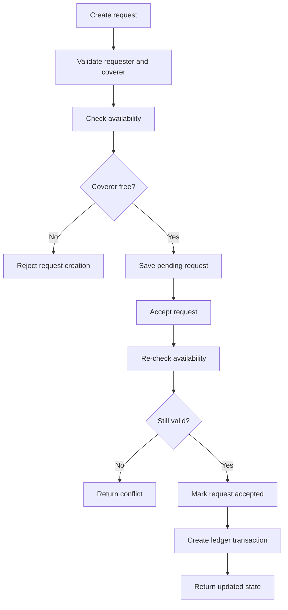

# Server API

This folder contains the EquiClass backend: an Express API that handles authentication, timetable persistence, substitute request workflows, ledger accounting, and routine availability checks.

## Responsibilities

- register and authenticate professors
- protect routes with JWT auth
- store weekly timetables and onboarding completion
- create and resolve substitute requests
- calculate ledger summaries and transaction history
- manage weekly routine data

## Request Resolution Flow



## Tech Stack

- Node.js 20+
- Express 4
- MongoDB + Mongoose
- JWT authentication
- bcryptjs
- Helmet
- CORS
- express-rate-limit
- express-mongo-sanitize

## Main Route Groups

| Group | Routes |
| --- | --- |
| Health | `GET /api/health` |
| Auth | `POST /api/auth/register`, `POST /api/auth/login`, `GET /api/auth/me` |
| Timetable | `GET /api/timetables/me`, `PUT /api/timetables/me`, `POST /api/timetables/availability`, `POST /api/timetables/override-availability` |
| Users | `GET /api/users` |
| Requests | `POST /api/requests`, `GET /api/requests/incoming`, `GET /api/requests/outgoing`, `PATCH /api/requests/:id/accept`, `PATCH /api/requests/:id/decline`, `PATCH /api/requests/:id/cancel` |
| Ledger | `GET /api/ledger/me/summary`, `GET /api/ledger/me/transactions`, `GET /api/ledger/pairwise` |
| Routine | `GET /api/routine/me`, `PUT /api/routine/update`, `POST /api/routine/check-availability` |

## Local Development

```bash
npm install
npm run dev
```

Default local port:

- `http://localhost:5000`

Health check:

- `http://localhost:5000/api/health`

## Environment Variables

Create `.env` from `.env.example` and configure:

| Variable | Required | Purpose |
| --- | --- | --- |
| `PORT` | No | API port, defaults to `5000` |
| `NODE_ENV` | No | runtime mode |
| `MONGO_URI` | Yes | MongoDB connection string |
| `JWT_SECRET` | Yes | JWT signing secret |
| `JWT_EXPIRES_IN` | No | token expiry, defaults to `15m` |
| `CORS_ORIGIN` | Yes in production | allowed frontend origin(s) |

## Deployment Notes

- [Dockerfile](Dockerfile) builds the production API image.
- [.env.example](.env.example) documents the required runtime variables.
- The production workflow deploys this API to EC2 through GitHub Actions and GHCR.

For deployment steps, see [../docs/Deployment.md](../docs/Deployment.md). For the full project overview, see [../README.md](../README.md).
